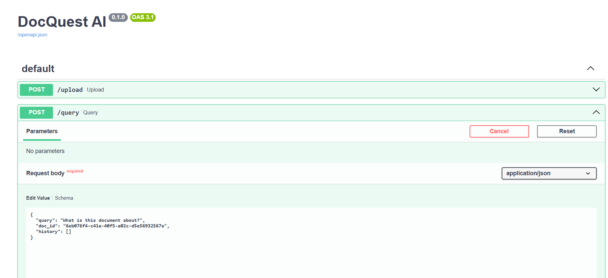
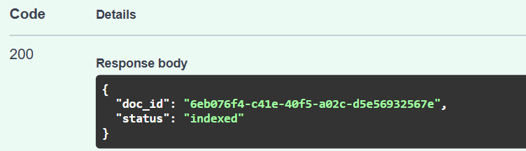
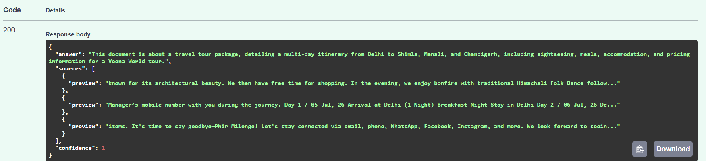

# DocQuest AI

AI-powered document question-answering system built using FastAPI, Qdrant, Gemini, and Retrieval-Augmented Generation (RAG).

---

## Overview

DocQuest AI enables users to upload PDF documents and ask natural language questions about their content.

The system processes documents through a multi-stage indexing pipeline, stores semantic representations in a vector database, retrieves relevant context using hybrid search, reranks results using a CrossEncoder model, and generates grounded answers using Google Gemini.

The project is designed with production-oriented RAG practices including hybrid retrieval, reciprocal rank fusion, reranking, evaluation, logging, health monitoring, Dockerization, and CI/CD automation.

---

## Key Features

### Document Processing

* PDF Upload and Indexing
* Text Extraction
* Text Cleaning and Normalization
* Intelligent Chunking
* Embedding Generation
* Qdrant Vector Storage
* BM25 Index Creation

### Retrieval Pipeline

* Semantic Search using Qdrant
* BM25 Keyword Search
* Hybrid Retrieval
* Reciprocal Rank Fusion (RRF)
* CrossEncoder Reranking
* Context Validation Guardrails

### Answer Generation

* Google Gemini 2.5 Flash
* Conversational Question Answering
* Source-aware Responses
* Confidence Scoring

### Engineering Features

* Structured Logging
* Retrieval Evaluation Framework
* Error Handling
* Health Monitoring
* Docker Support
* Docker Compose Deployment
* GitHub Actions CI/CD
* Dependabot Dependency Monitoring

---

## Tech Stack

### Backend

* Python
* FastAPI
* Pydantic

### AI / ML

* Google Gemini 2.5 Flash
* Sentence Transformers
* CrossEncoder Reranker
* Retrieval-Augmented Generation (RAG)

### Vector Database

* Qdrant

### Retrieval

* Dense Retrieval
* BM25 Retrieval
* Hybrid Search
* Reciprocal Rank Fusion (RRF)

### DevOps

* Docker
* Docker Compose
* GitHub Actions
* Dependabot

### Testing

* Pytest
* HTTPX

---

## Project Structure

```text
DocQuest_AI/
│
├── app/
│   ├── indexing/
│   │   ├── extractor.py
│   │   ├── cleaner.py
│   │   ├── chunker.py
│   │   ├── embedder.py
│   │   ├── qdrant_store.py
│   │   ├── bm25_index.py
│   │   ├── storage.py
│   │   └── pipeline.py
│   │
│   ├── retrieval/
│   │   ├── rewrite.py
│   │   ├── hybrid.py
│   │   ├── reranker.py
│   │   ├── guardrails.py
│   │   ├── llm.py
│   │   └── pipeline.py
│   │
│   ├── utils/
│   │   └── logger.py
│   │
│   └── main.py
│
├── tests/
│   ├── evaluate_retrieval.py
│   └── evaluation_questions.json
│
├── storage/
│   └── bm25/
│
├── docs/
│   └── screenshots/
│
├── .github/
│   ├── workflows/
│   │   └── ci.yml
│   └── dependabot.yml
│
├── Dockerfile
├── docker-compose.yml
├── requirements.txt
└── README.md
```

---

## Architecture

### Document Indexing Pipeline

```text
PDF Upload
    ↓
Text Extraction
    ↓
Cleaning
    ↓
Chunking
    ↓
Embedding Generation
    ↓
Qdrant Storage
    ↓
Chunk Persistence
    ↓
BM25 Index Creation
```

### Retrieval Pipeline

```text
User Query
    ↓
Query Rewriting
    ↓
Dense Retrieval (Qdrant)
           +
BM25 Retrieval
    ↓
Reciprocal Rank Fusion (RRF)
    ↓
CrossEncoder Reranking
    ↓
Guardrails Validation
    ↓
Gemini 2.5 Flash
    ↓
Answer + Sources + Confidence
```

---

## Retrieval Pipeline

DocQuest AI uses a multi-stage retrieval architecture to improve answer quality and retrieval relevance.

### Stage 1: Query Rewriting

User queries are normalized before retrieval.

### Stage 2: Dense Retrieval

Semantic similarity search is performed using Sentence Transformers embeddings stored in Qdrant.

### Stage 3: BM25 Retrieval

Keyword-based retrieval is performed using BM25.

### Stage 4: Reciprocal Rank Fusion (RRF)

Dense and sparse retrieval results are combined using Reciprocal Rank Fusion.

### Stage 5: CrossEncoder Reranking

Retrieved chunks are reranked using a CrossEncoder model to improve relevance.

### Stage 6: Context Validation

Retrieved chunks are validated before answer generation.

### Stage 7: Answer Generation

Gemini 2.5 Flash generates the final grounded response.

---

## Evaluation

The retrieval layer includes a dedicated evaluation framework.

Evaluation metrics include:

* Retrieval Coverage
* Keyword Hit Rate
* Dense Retrieval Quality
* BM25 Retrieval Quality
* Hybrid Retrieval Effectiveness

Run evaluation:

```bash
python tests/evaluate_retrieval.py
```

---

## Local Setup

### Clone Repository

```bash
git clone https://github.com/pragathijp/DocQuest_AI.git
cd DocQuest_AI
```

### Install Dependencies

```bash
pip install -r requirements.txt
```

### Configure Environment

Create a `.env` file:

```env
GEMINI_API_KEY=your_api_key_here
```

### Start Qdrant

```bash
docker run -p 6333:6333 qdrant/qdrant
```

### Run Backend

```bash
uvicorn app.main:app --reload
```

### Swagger Documentation

```text
http://127.0.0.1:8000/docs
```

---

## Docker Deployment

Start the complete stack:

```bash
docker compose up --build
```

Services:

Backend:

```text
http://localhost:8000
```

Swagger UI:

```text
http://localhost:8000/docs
```

Qdrant:

```text
http://localhost:6333/dashboard
```

---

## API Endpoints

### Upload Document

**POST /upload**

Uploads and indexes a PDF document.

Returns:

```json
{
  "doc_id": "uuid",
  "status": "indexed"
}
```

### Query Document

**POST /query**

Queries an indexed document and returns an answer.

---

## Health Monitoring

### Health Check

```http
GET /health
```

Returns application health status.

### Readiness Check

```http
GET /ready
```

Verifies backend readiness and Qdrant availability.

---

## CI/CD

The project includes:

* Automated Testing with Pytest
* GitHub Actions CI Pipeline
* Dependabot Dependency Updates
* Dockerized Deployment Support

---

## Screenshots

### Swagger API



### Document Upload



### Query Response



---

## Future Enhancements

* Multi-document Querying
* Authentication and Authorization
* Streaming Responses
* Cloud Deployment
* Advanced Analytics Dashboard
* Frontend Enhancements

---

## Author

**Pragathi J**

B.E. Computer Science Engineering (Data Science)

GitHub: https://github.com/pragathijp

LinkedIn: https://linkedin.com/in/pragathi-j-pastay-056461256
